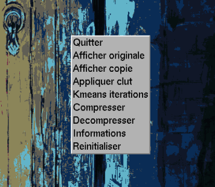

# Compression d'image par "Color Quantization"

Projet académique d'implémentation de l'algorithme des [k-moyennes](https://fr.wikipedia.org/wiki/K-moyennes) appliqué en compression d'image.

## Description 

### Objectif

L'objectif est de réduire la taille mémoire d'une image au format [.ppm](https://fr.wikipedia.org/wiki/Portable_pixmap) en limitant son spectre colorimétrique ([Color Quantization](https://en.wikipedia.org/wiki/Color_quantization)) sans perte majeure de qualité visuelle.

### Principe de la CLUT

L'idée est de construire une CLUT (Color Look-Up Table) qui contiendra les n couleurs les plus significatives de l'image. L'image compressée ne stockera plus une valeur RGB complète pour chaque pixel, mais simplement un index pointant vers une couleur de cette table.
- Gain mémoire : Au lieu de 3 octets par pixel, 1 seul octet suffit pour une palette allant jusqu'à 256 couleurs.

### Optimisation par les k-moyennes

L'algo affine itérativement la précision des couleurs de la CLUT :
- **Regroupement** : Chaque pixel de l’image est rattaché à la couleur la plus proche dans la CLUT.
- **Ajustement** : On calcule la couleur "moyenne" de tous les pixels d'un même groupe pour définir la nouvelle couleur de référence.

### Specs technique

- **Langage :** C  
- **Dépendances :** GLUT / OpenGL  
- **Format d'entrée :** `.ppm` (Portable Pixmap)  
- **Format de sortie :** `.km` (Format binaire compressé)

## 🛠️ Installation et utilisation

### Prérequis

Avoir `make`, un compilateur `gcc` et les librairies `OpenGL` /`GLUT` installées en local.

### Execution
Pour compiler et exécuter le programme avec une image :

```bash
make all && ./palette image.ppm
```

### Menu



Chaque option du menu graphique correspond à une fonctionnalité spécifique :

- **Afficher copie** réaffiche la copie de l’image.  
*(La copie est une image qui est créé en mémoire à partir de l’original, c’est
celle-ci qui subira des modifications.)*

- **Appliquer clut** créé une nouvelle CLUT de n couleurs (n étant définit
dans la directive de préprocesseur nommée NB_COULEURS ) et l’applique
en écrasant la copie.

- **Kmeans itérations** permet de lancer l’agorithme avec un nombre d’itération ne dépassant pas le seuil défini dans la directive de préprocesseur
nommée KMEANS_ITER

- **Compresser** écrit dans un fichier nommé arbitrairement image.km
les données binaires de l’image suivant le format de compression décrit précedemment. L’image original est ensuite réaffichée à l’écran.

- **Decompresser** lit le fichier binaire image.km et l’affiche à l’écran.

### Shortcuts

| Touche | Fonctionnalité |
| :--- | :--- |
| **Échap** | Quitter le programme |
| **Espace** | Créer une nouvelle CLUT avec le même nombre de couleurs que l’actuelle |
| **+** | Augmenter le nombre de couleurs de 1 |
| **-** | Diminuer le nombre de couleurs de 1 |
| **P** | Afficher le contenu de la CLUT |
| **S** | Passer de l’image originale à la copie et vice-versa |
| **T** | Appliquer un déplacement des moyennes |